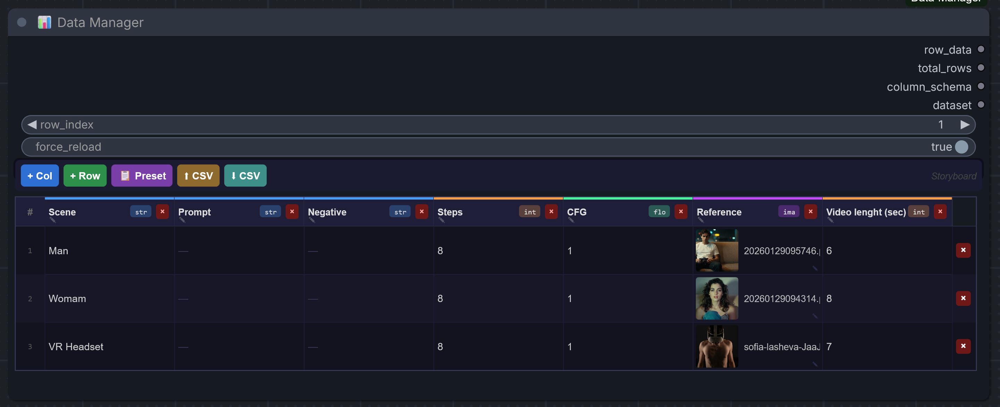
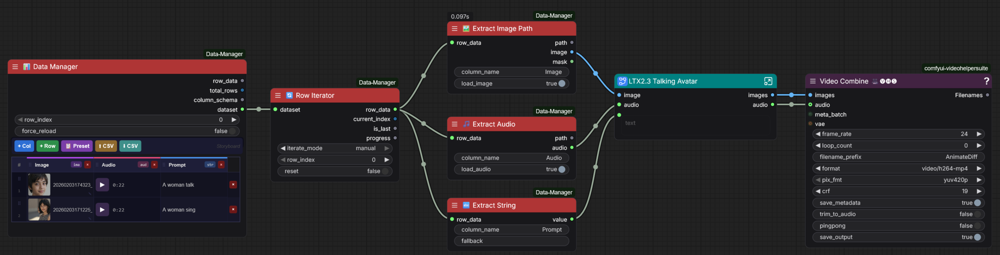

# 📊 ComfyUI Data Manager

A custom node pack for ComfyUI that adds an **interactive Excel-like grid**
directly inside your workflows — ideal for storyboards, character sheets, dataset builders and more.





---

## 📦 Installation

```bash
# From ComfyUI's custom_nodes folder
cd ComfyUI/custom_nodes
git clone https://github.com/florestefano1975/ComfyUI-Data-Manager
# or copy the folder manually
```

Restart ComfyUI. The nodes will appear under the **Data Manager** category.

---

## 🧩 Available Nodes

### 📊 Data Manager  _(main node)_

The central node with the interactive grid.

**Grid interactions:**
| Action | How |
|---|---|
| Add column | `+ Col` button in the toolbar |
| Add row | `+ Row` button in the toolbar |
| Edit column name/type | Click on the column header (centre area) |
| Reorder columns | Drag the `⠿` handle on the left side of the column header |
| Resize column | Drag the `↔` handle on the right edge of the column header |
| Delete column | Click the `×` button on the right side of the header |
| Reorder rows | Drag the `⠿` handle in the top half of the row index cell |
| Edit cell | Click on a cell → edit dialog |
| Duplicate row | `⧉` button on the right of the row (inserts a copy below) |
| Delete row | `×` button on the right of the row |
| Apply preset | `📋 Preset` button |
| Import CSV | `⬆ CSV` button |
| Export CSV | `⬇ CSV` button |

**Column types:**
| Type | Color | Description |
|---|---|---|
| `string` | blue | Free text |
| `int` | orange | Integer number |
| `float` | green | Decimal number |
| `image` | purple | Image file — inline thumbnail, picked from ComfyUI input folder |
| `audio` | pink | Audio file — inline ▶/⏹ player with duration, picked from ComfyUI input folder |
| `boolean` | teal | True/False checkbox — click to toggle, no dialog |
| `select` | yellow | Enum dropdown — options defined at column creation, click to pick |

**Inputs:**
- `row_index` — index of the row to emit (0-based)
- `force_reload` _(optional)_ — reload data from external file before execution

**Outputs:**
- `row_data` → `DM_ROW` — dictionary of the selected row
- `total_rows` → `INT` — total number of rows
- `column_schema` → `DM_SCHEMA` — map `{label: type}`
- `dataset` → `DM_DATASET` — full dataset (schema + raw rows), connect to Row Iterator

**Built-in presets:** Storyboard, Character Sheet, Dataset Builder.

**Bidirectional sync:**
Set `file_path` in the node metadata to enable automatic sync to disk.
The node saves both `.json` and `.csv` on every execution.

---

### 🔍 Column Extractor  _(generic)_

Extracts any column value as a string. Useful for quick debugging.

```
row_data + column_name → value (STRING)
```

---

### 🔤 Extract String / 🔢 Extract Int / 🔣 Extract Float

Typed extractors with an optional `fallback` value if the cell is empty.

```
row_data + column_name + fallback → value (STRING | INT | FLOAT)
```

---

### ✅ Extract Bool

Extracts a boolean column. Emits a `BOOLEAN` value with an optional fallback.

```
row_data + column_name + fallback → value (BOOLEAN)
```

---

### 🔽 Extract Select

Extracts a select/enum column. Emits the selected option as `STRING`,
or the fallback value if the cell is empty.

```
row_data + column_name + fallback → value (STRING)
```

---

### 🖼️ Extract Image Path

Extracts an image column. Resolves the filename against the ComfyUI `input/` folder,
loads the file from disk and converts it to a tensor ready for the pipeline.

```
row_data + column_name + load_image → path (STRING) + image (IMAGE) + mask (MASK)
```

If the file is missing, emits a blank 64×64 black image instead of crashing.

---

### 🎵 Extract Audio

Extracts an audio column. Resolves the filename against the ComfyUI `input/` folder
and loads the file as a native ComfyUI `AUDIO` tensor compatible with `PreviewAudio`,
`SaveAudio` and any other standard audio node.

```
row_data + column_name + load_audio → path (STRING) + audio (AUDIO)
```

Uses `torchaudio` (bundled with ComfyUI) with `soundfile` as fallback.
If the file is missing, emits a silent 1-sample placeholder instead of crashing.

---

### 🔄 Row Iterator

Iterates over all rows of the dataset, one per execution.

**Connection:** `Data Manager.dataset` → `Row Iterator.dataset`

**Mode `manual`** — always emits the row at `row_index` (static).

**Mode `auto`** — advances one row per execution. Use it with repeated
_Queue Prompt_ to automatically process the entire dataset in batch.
Check `is_last` to know when to stop.

**Outputs:**
- `row_data` → `DM_ROW` — current row as a typed dictionary
- `current_index` → `INT` — 0-based index of the current row
- `is_last` → `BOOLEAN` — `True` if this is the last row
- `progress` → `STRING` — e.g. `"3 / 10"` for display

---

## 🎬 Example: Storyboard workflow

```
[Data Manager]
  ├── Preset: Storyboard
  │   Columns: Scene | Prompt | Negative | Seed | Steps | CFG | Reference | Audio
  │
  ├── dataset ──────────────→ [Row Iterator] (batch mode)
  │
  └── row_data ─────────────→ [Extract String: "Prompt"]    → [CLIP Text Encode]
                            → [Extract String: "Negative"]  → [CLIP Text Encode (neg)]
                            → [Extract Int:    "Seed"]      → [KSampler seed]
                            → [Extract Int:    "Steps"]     → [KSampler steps]
                            → [Extract Float:  "CFG"]       → [KSampler cfg]
                            → [Extract Image:  "Reference"] → [Load Image / IP-Adapter]
                            → [Extract Audio:  "Audio"]     → [PreviewAudio]
```

---

## 📁 File structure

```
comfyui-data-manager/
├── __init__.py                  # Node registration + custom API routes
├── nodes/
│   ├── __init__.py
│   ├── data_manager.py          # Main node + CSV/JSON bidirectional sync
│   ├── column_extractor.py      # Typed extractor nodes (string/int/float/image/audio)
│   └── row_iterator.py          # Batch row iterator
└── web/
    └── js/
        └── data_manager.js      # LiteGraph interactive grid widget (frontend)
```

---

## 🌐 Custom API routes

The pack registers the following HTTP endpoints on the ComfyUI server:

| Endpoint | Description |
|---|---|
| `GET /api/dm/list_inputs` | Returns all image + audio files in the `input/` folder |
| `GET /api/dm/list_audio` | Returns only audio files in the `input/` folder |
| `GET /api/dm/duration?filename=…&subfolder=…` | Returns duration (seconds) of an audio file, read server-side via `mutagen` |

These are used internally by the grid widget. A **restart of ComfyUI** is required after installation or update for the routes to be registered.

---

## 💾 Internal data format (JSON)

The grid data is stored directly inside the workflow `.json` file under `widgets_values`,
so it travels with the workflow automatically. A sample payload:

```json
{
  "schema": [
    {"id": "col_abc123", "label": "Prompt",    "type": "string"},
    {"id": "col_def456", "label": "Seed",      "type": "int"},
    {"id": "col_ghi789", "label": "Reference", "type": "image"},
    {"id": "col_jkl012", "label": "Music",     "type": "audio"}
  ],
  "rows": [
    {
      "col_abc123": "A dark forest at dusk",
      "col_def456": 42,
      "col_ghi789": {"filename": "scene1.png", "subfolder": "", "type": "input"},
      "col_jkl012": {"filename": "theme.mp3",  "subfolder": "", "type": "input"}
    }
  ],
  "meta": {
    "name": "MyStoryboard",
    "file_path": "data/mystoryboard.json"
  }
}
```

---

## ⚠️ Notes

- Column widths are adjustable by dragging the `↔` handle on the right edge of any column header. The minimum width is 60px. Widths are persisted in the workflow JSON (inside `meta.col_widths`) and restored automatically on reload.
- `select` columns store their list of options inside the column schema. Options are defined when creating or editing the column and can be updated at any time — existing cell values are preserved.
- Columns and rows can be reordered by dragging the `⠿` handle — column headers on the left strip, rows on the top half of the index cell.
- Both `image` and `audio` cells store a `{filename, subfolder, type}` object, resolved against ComfyUI's `input/` folder at execution time.
- Image thumbnails and audio playback in the grid use the ComfyUI `/view` endpoint — files must be uploaded via the grid picker or the native Load Image node.
- In `auto` mode the Row Iterator uses `IS_CHANGED` to force re-execution on every queue — always check `is_last` to implement a stop condition.
- The JSON payload is stored in the workflow itself: data travels with the `.json` file without any external dependency.
- If `file_path` is set, the node additionally saves a `.json` + `.csv` copy to disk on every execution as backup.

---

## 🛠️ Requirements

- ComfyUI (recent version with custom widget support)
- Python 3.10+
- `Pillow` — image loading (included in ComfyUI)
- `torch` / `torchaudio` — tensor ops and audio loading (included in ComfyUI)
- `mutagen` _(optional)_ — fast server-side audio duration reading; falls back to `wave` module if missing
- `soundfile` _(optional)_ — audio loading fallback if `torchaudio` fails

No additional dependencies are required for the `boolean` column type.
